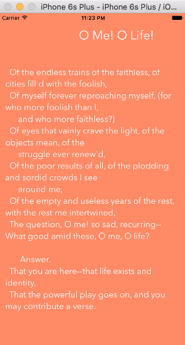

# Leaves of Grass by Walt Whitman

Currently displays a random poem from Whitman's Leaves of Grass. The book text is retrieved through [Walt Whitman Poems API](https://market.mashape.com/pafmon/walt-whitman-poems) on [Mashape](https://market.mashape.com). Ultimately the text is made available through [Project Gutenberg](http://www.gutenberg.org/).

